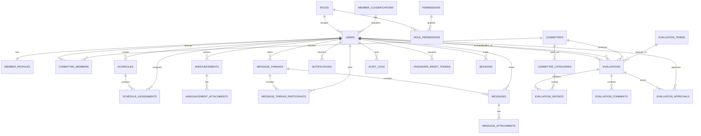

# 3. Database Design

Engine: **SQLite (better-sqlite3)**, WAL mode, foreign keys enforced, prepared statements only. Timestamps stored as UTC ISO-8601 text; dates as `YYYY-MM-DD`; times as `HH:MM` (24h).

## 3.1 Entity Relationship Diagram



## 3.2 Tables

| Table | Purpose | Key fields / constraints |
|---|---|---|
| `roles` | Access levels | `code` UNIQUE (`member`/`officer`/`committee`/`admin`) |
| `permissions` | Permission catalogue | `code` UNIQUE |
| `role_permissions` | Role→permission mapping | PK(`role_id`,`permission_id`), FKs cascade |
| `member_classifications` | Lector, Commentator, … | `name` UNIQUE |
| `users` | Accounts | `username` UNIQUE NOCASE; `password_hash` (bcrypt); `status` IN active/inactive/suspended/pending; `must_change_password`; `role_id`, `classification_id` FKs; `last_login_at`; timestamps |
| `member_profiles` | Extended profile | PK=`user_id` FK; birthday, address, emergency contact, bio, notes |
| `committees` | Evaluation committees | `code` UNIQUE (screening/discipline/readers) |
| `committee_categories` | Rating categories per committee | FK committee; `sort_order` |
| `committee_members` | Committee membership (M:N) | UNIQUE(`committee_id`,`user_id`); `role_in_committee` (chair/secretary/member) |
| `schedules` | Service schedules | `schedule_date`, `start_time`, `end_time`, `venue`, `status` IN draft/published/cancelled |
| `schedule_assignments` | Member roles on a schedule | UNIQUE(`schedule_id`,`user_id`) prevents double-booking same slot; `role` (Lector/Commentator/…), `status` IN confirmed/pending/declined/replaced |
| `announcements` | Ministry news | `status` IN draft/published/archived; `publish_at`, `expires_at`, `published_at` |
| `announcement_attachments` | Uploaded files | original + stored names, mime, size |
| `message_threads` | Conversations | `title` (optional) |
| `message_thread_participants` | Thread privacy (M:N) | PK(`thread_id`,`user_id`); `last_read_at` → unread counts |
| `messages` | Thread messages | `status` IN sent/edited/deleted (soft delete); timestamps; attachments optional |
| `message_attachments` | Message files | like announcement attachments |
| `notifications` | In-app alerts | `type` (announcement/message/schedule/evaluation/account/admin/deadline), `is_read`, `link` |
| `evaluation_terms` | Evaluation periods | `name`, `start_date`, `end_date`, `is_active`; admin-configurable (defaults T1 Jan–Apr, T2 May–Jul, T3 Aug–Nov) |
| `evaluations` | One evaluation row = committee×evaluator×member×term | UNIQUE(`committee_id`,`evaluator_id`,`member_id`,`term_id`); `status` IN draft/submitted/pending_review/returned/resubmitted/approved/released; `overall_average`; submission/approval/release timestamps |
| `evaluation_ratings` | Per-category scores | UNIQUE(`evaluation_id`,`category_id`); `rating` CHECK 1..5 |
| `evaluation_comments` | Comment/observation/recommendation/improvement | `is_visible_to_member` flag |
| `evaluation_approvals` | Approval/revision history (audit) | `action`, `previous_status`, `new_status`, `notes`, admin, timestamp |
| `audit_logs` | Immutable admin/eval trail | actor, action, entity, details (JSON), IP, timestamp |
| `system_settings` | Key/value config | `key` PK |
| `sessions` | Server-side sessions | `sid` PK, `user_id`, `expires_at` (ms), IP/UA |
| `password_reset_tokens` | Reset workflow | hashed token, expiry, `used_at` |

## 3.3 Status Enumerations

```
users.status:            active | inactive | suspended | pending
schedules.status:        draft | published | cancelled
schedule_assignments:    confirmed | pending | declined | replaced
announcements.status:    draft | published | archived
messages.status:         sent | edited | deleted
evaluations.status:      draft | submitted | pending_review | returned | resubmitted | approved | released
evaluation_ratings:      CHECK(rating BETWEEN 1 AND 5)
```

## 3.4 Key Indexes

- `users(username)`, `users(status)`, `users(role_id)`
- `schedule_assignments(user_id)`, `schedule_assignments(schedule_id)`
- `schedules(schedule_date)`
- `announcements(status, publish_at)`, `announcements(author_id)`
- `messages(thread_id, created_at)`
- `message_thread_participants(user_id)`
- `notifications(user_id, is_read)`
- `evaluations(status)`, `evaluations(member_id, term_id)`, `evaluations(committee_id, term_id)`
- `evaluation_ratings(evaluation_id)`, `evaluation_comments(evaluation_id)`
- `audit_logs(created_at)`, `audit_logs(user_id)`

## 3.5 Integrity & Business Rules Encoded in the Schema

- Unique accounts: `users.username` UNIQUE.
- One assignment per member per schedule: UNIQUE(schedule_id, user_id).
- One evaluation per (committee, evaluator, member, term): UNIQUE — accidental duplicates are impossible.
- Ratings bounded 1–5 at DB level.
- FK cascade policy: *child records* cascade on user delete, but the system **deactivates** users instead of deleting them (soft delete) so historical evaluations, schedules, and messages stay correctly attributed. Hard delete is only exposed for admin use with explicit confirmation and audits the action.
- All money-free, audit timestamps auto-set via `DEFAULT (datetime('now'))`.
